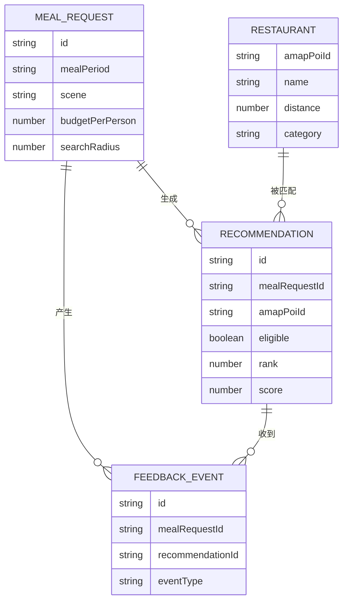
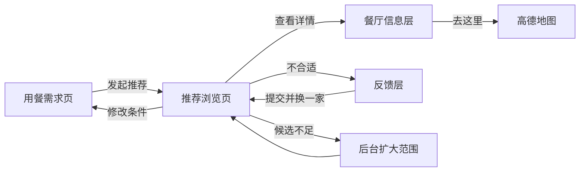

# 饮食小助手 MVP 结构

## 已确认的产品边界

- 产品形态：移动端优先的网页。
- 目标用户：临近用餐、难以快速决定吃什么的普通个人用户。
- 核心任务：根据位置、餐次、场景和预算，在一分钟内选出一家愿意去的附近餐厅。
- 数据来源：高德 MCP。
- MVP 不包含登录、自己做、记一笔、个人中心、支付、社交和医疗建议。

## 第一步：核心对象

### 1. 用餐需求

用户本次要解决的吃饭问题，包含位置、餐次、场景、预算和偏好。

### 2. 餐厅

高德 MCP 返回的真实地点，包含位置、距离、品类、评分、营业信息和导航信息。

### 3. 推荐结果

某次用餐需求与某家餐厅之间的匹配结果，保存是否符合条件、展示顺序和推荐理由。

### 4. 用户反馈

记录用户查看、跳过、选择、导航和认为推荐不合适的原因，用于判断 MVP 是否有效。

### 边界说明

- 高德 MCP 是数据来源，不是产品对象。
- 定位是用餐需求的属性。
- 导航是用户对餐厅执行的操作。
- MVP 没有账号体系，因此暂时没有用户对象。

## 第二步：CSMA 拆解

### 用餐需求

#### C：核心属性

| 字段 | MVP 必需 | 说明 |
|---|---:|---|
| `id` | 是 | 本次用餐需求的唯一标识 |
| `longitude` / `latitude` | 是 | 用户当前位置坐标 |
| `locationLabel` | 是 | 用户能看懂的位置名称 |
| `mealPeriod` | 是 | 早餐、午餐、晚餐或夜宵 |
| `scene` | 是 | 日常、请客、一个人或清淡等场景 |
| `budgetPerPerson` | 是 | 人均预算上限 |
| `searchRadius` | 是 | 初始搜索半径，默认 1 公里 |
| `preferences` | 否 | 口味或品类偏好 |
| `createdAt` | 是 | 发起时间 |

#### S：状态

```text
编辑中
  → 已定位
  → 查询中
  → 已返回结果
      → 已选择餐厅
      → 已放弃
  → 无结果
      → 扩大范围后重新查询
  → 查询失败
      → 重试
```

#### M：元信息

- 城市编码与行政区
- 定位来源：浏览器定位或手动选择
- 匿名会话标识
- 当前筛选规则版本

#### A：操作

- 修改餐次、场景、预算和偏好
- 获取或重新获取位置
- 发起推荐
- 扩大搜索范围
- 重试失败查询
- 结束本次选择

### 餐厅

#### C：核心属性

| 字段 | MVP 必需 | 说明 |
|---|---:|---|
| `amapPoiId` | 是 | 高德 POI 唯一标识 |
| `name` | 是 | 餐厅名称 |
| `longitude` / `latitude` | 是 | 餐厅坐标 |
| `address` | 是 | 门店地址 |
| `distance` | 是 | 距用户当前位置的距离 |
| `category` | 是 | 高德地点分类或餐饮品类 |
| `rating` | 否 | 高德返回的评分 |
| `averageCost` | 否 | 高德返回的人均消费 |
| `businessHours` | 否 | 营业时间 |
| `photos` | 否 | 餐厅图片列表 |
| `navigationUrl` | 是 | 打开高德导航的链接 |

#### S：状态

餐厅本身由高德管理，MVP 只保存查询时的快照状态：

```text
未知营业状态 / 营业中 / 已打烊
候选餐厅 / 不符合条件 / 已展示 / 被选择
```

#### M：元信息

- 数据来源固定为高德
- 数据拉取时间
- 图片、评分、价格等字段的完整度
- 高德原始地点类型

#### A：操作

- 查看餐厅卡片
- 查看下一家
- 选择餐厅
- 打开高德导航
- 标记推荐不合适

### 推荐结果

#### C：核心属性

| 字段 | MVP 必需 | 说明 |
|---|---:|---|
| `id` | 是 | 推荐结果唯一标识 |
| `mealRequestId` | 是 | 关联的用餐需求 |
| `amapPoiId` | 是 | 关联的餐厅 |
| `eligible` | 是 | 是否通过硬性筛选 |
| `rank` | 是 | 展示顺序 |
| `score` | 是 | 排序分数 |
| `recommendationReasons` | 是 | 展示给用户的推荐理由 |
| `exclusionReasons` | 否 | 未通过筛选的原因 |

#### S：状态

```text
已生成
  → 被过滤
  → 进入候选
      → 已展示
          → 被跳过
          → 被选择
      → 未展示即过期
```

#### M：元信息

- 筛选规则版本
- 排序规则版本
- 生成时间
- 候选总数与过滤后数量

#### A：操作

- 查看推荐理由
- 换一家
- 选择餐厅
- 提交不合适反馈

### 用户反馈

#### C：核心属性

| 字段 | MVP 必需 | 说明 |
|---|---:|---|
| `id` | 是 | 反馈事件唯一标识 |
| `mealRequestId` | 是 | 对应的用餐需求 |
| `recommendationId` | 否 | 对应的推荐结果 |
| `eventType` | 是 | 查看、跳过、选择、导航或不合适 |
| `reason` | 否 | 不合适的具体原因 |
| `createdAt` | 是 | 事件发生时间 |

#### S：状态

```text
已产生 → 已记录
       → 记录失败 → 重试
```

#### M：元信息

- 匿名会话标识
- 当前规则版本
- 页面版本

#### A：操作

- 自动记录查看、换一家、选择和导航
- 用户主动选择“不合适”的原因
- 失败后重新上报

## 第三步：对象关系

### 关系总览



### 关系说明

| 起点 | 终点 | 关系 | 是否从属 | 说明 |
|---|---|---|---:|---|
| 用餐需求 | 推荐结果 | 一对多 | 是 | 一次查询会生成多条推荐结果；删除本次需求时一并删除 |
| 餐厅 | 推荐结果 | 一对多 | 否 | 同一家餐厅可以出现在多次用餐需求里 |
| 用餐需求 | 用户反馈 | 一对多 | 是 | 一次选择过程会产生查看、跳过、选择和导航等多个事件 |
| 推荐结果 | 用户反馈 | 一对多 | 否 | 单条推荐可以收到多个事件；有些会话级反馈不关联具体推荐 |

### 数据流

```text
用户填写用餐需求
  → 后端调用高德 MCP 查询附近餐厅
  → 餐厅数据标准化
  → 硬性筛选
  → 生成推荐结果并排序
  → 前端展示餐厅卡片
  → 用户换一家、选择或导航
  → 记录用户反馈
```

### 页面跳转约束

- 用户只能从当前用餐需求进入推荐结果，不能脱离需求直接浏览全量餐厅。
- 餐厅详情由推荐结果进入，返回时保留当前需求和浏览位置。
- 点击导航属于推荐结果的最终转化动作，同时打开高德。
- 用户换一家只改变当前展示的推荐结果，不重新创建用餐需求。
- 当前候选池不足时，系统扩大范围并补充推荐结果，不清空已浏览记录。

### 删除与保留规则

- 用户主动重新开始时，创建新的用餐需求；旧需求不再继续追加推荐。
- 用餐需求及其推荐结果和反馈保留到 MVP 测试结束，用于计算选择率和导航率。
- 餐厅数据只保存查询快照，不建立长期自营餐厅库。
- 同一个高德 POI 在不同查询中可以保留不同的距离、营业状态和抓取时间。

## 第四步：页面结构

MVP 使用移动端优先的单任务流程，不保留课件成品中的多标签导航。

### 1. 用餐需求页 `/`

**包含对象**

- 用餐需求

**页面内容**

- 当前地点
- 餐次选择
- 用餐场景
- 人均预算
- 发起推荐按钮

**核心操作**

- 浏览器自动定位
- 手动修改地点
- 修改餐次、场景和预算
- 发起推荐

**页面状态**

- 默认状态：餐次根据当前时间预选
- 定位中：禁止重复触发定位
- 定位被拒绝：显示手动地点输入
- 定位失败：显示重试和手动输入
- 表单不完整：按钮禁用并标明缺少内容

### 2. 推荐浏览页 `/recommendations/:mealRequestId`

**包含对象**

- 用餐需求摘要
- 推荐结果
- 餐厅快照
- 用户反馈

**页面内容**

- 当前餐次、场景和位置摘要
- 当前推荐序号和候选数量
- 餐厅卡片：图片、名称、品类、距离、评分、人均、营业状态
- 推荐理由
- 换一家与去这里

**核心操作**

- 查看当前推荐
- 左右切换图片
- 换一家
- 选择并打开高德导航
- 标记推荐不合适
- 返回修改用餐需求

**页面状态**

- 查询中：展示明确的查询进度
- 首批结果已返回：立即展示第一家，其余候选继续处理
- 候选不足：后台扩大范围，不打断当前浏览
- 没有结果：提供扩大范围和修改条件
- 高德查询失败：保留用户条件并允许重试
- 图片缺失：使用品类占位图，不显示破图
- 价格或评分缺失：隐藏对应字段，不用零值代替

### 3. 餐厅信息层

MVP 不做独立详情页。点击餐厅卡片后，从推荐浏览页底部展开信息层。

**包含对象**

- 餐厅快照
- 推荐结果

**页面内容**

- 完整地址
- 营业时间
- 电话
- 更多图片
- 推荐与筛选依据
- 去高德导航

**核心操作**

- 收起信息层
- 打开高德
- 标记信息或推荐不合适

### 4. 不合适反馈层

**包含对象**

- 用户反馈
- 推荐结果

**反馈选项**

- 不符合当前餐次
- 不适合当前场景
- 超出预算
- 距离太远
- 已打烊
- 不喜欢这个品类
- 其他

提交后自动展示下一家，不阻塞用餐流程。

### 页面流转



## 数据模型草案

MVP 可以先使用轻量数据库。所有主键使用字符串 UUID，时间统一保存为 UTC。

### `meal_requests`

| 字段 | 类型 | 约束 |
|---|---|---|
| `id` | text | 主键 |
| `session_id` | text | 非空，匿名会话 |
| `longitude` | decimal | 非空 |
| `latitude` | decimal | 非空 |
| `location_label` | text | 非空 |
| `city_code` | text | 可空 |
| `meal_period` | text | 非空 |
| `scene` | text | 非空 |
| `budget_per_person` | integer | 非空 |
| `search_radius` | integer | 非空 |
| `preferences_json` | json | 可空 |
| `status` | text | 非空 |
| `rule_version` | text | 非空 |
| `created_at` | timestamp | 非空 |
| `completed_at` | timestamp | 可空 |

### `restaurant_snapshots`

每次查询保存当时的高德数据，避免营业状态、距离等动态字段污染其他用餐需求。

| 字段 | 类型 | 约束 |
|---|---|---|
| `id` | text | 主键 |
| `meal_request_id` | text | 外键，非空 |
| `amap_poi_id` | text | 非空 |
| `name` | text | 非空 |
| `longitude` | decimal | 非空 |
| `latitude` | decimal | 非空 |
| `address` | text | 非空 |
| `distance` | integer | 非空，单位米 |
| `category` | text | 非空 |
| `rating` | decimal | 可空 |
| `average_cost` | integer | 可空 |
| `business_status` | text | 非空 |
| `business_hours_json` | json | 可空 |
| `photos_json` | json | 可空 |
| `phone` | text | 可空 |
| `navigation_url` | text | 非空 |
| `source_payload_json` | json | 可空，调试用 |
| `fetched_at` | timestamp | 非空 |

唯一约束：`meal_request_id + amap_poi_id`。

### `recommendations`

| 字段 | 类型 | 约束 |
|---|---|---|
| `id` | text | 主键 |
| `meal_request_id` | text | 外键，非空 |
| `restaurant_snapshot_id` | text | 外键，非空 |
| `eligible` | boolean | 非空 |
| `rank` | integer | 可空，被过滤时为空 |
| `score` | decimal | 可空 |
| `reasons_json` | json | 非空 |
| `exclusion_reasons_json` | json | 可空 |
| `status` | text | 非空 |
| `rule_version` | text | 非空 |
| `created_at` | timestamp | 非空 |

唯一约束：`meal_request_id + restaurant_snapshot_id`。

### `feedback_events`

| 字段 | 类型 | 约束 |
|---|---|---|
| `id` | text | 主键 |
| `session_id` | text | 非空 |
| `meal_request_id` | text | 外键，非空 |
| `recommendation_id` | text | 外键，可空 |
| `event_type` | text | 非空 |
| `reason` | text | 可空 |
| `page_version` | text | 非空 |
| `rule_version` | text | 非空 |
| `created_at` | timestamp | 非空 |

### MVP 指标

| 指标 | 计算方式 | 用途 |
|---|---|---|
| 一分钟选择率 | 一分钟内产生 `selected` 的需求数 / 有结果的需求数 | 核心价值验证 |
| 导航点击率 | 产生 `navigate` 的需求数 / 有结果的需求数 | 判断推荐是否转化为行动 |
| 推荐跳过率 | `skip` 数 / `view` 数 | 判断整体推荐质量 |
| 明显错误率 | 餐次不符、已打烊等反馈数 / 已展示推荐数 | 判断硬性筛选是否可靠 |
| 无结果率 | 无结果需求数 / 总需求数 | 判断搜索范围和数据覆盖 |

## 待进入开发拆解的功能

1. 创建用餐需求并处理定位异常。
2. 调用高德 MCP 获取、标准化并缓存餐厅快照。
3. 按餐次、营业状态、场景和预算执行筛选与排序。
4. 浏览候选餐厅并在不足时补充。
5. 打开高德导航并记录 MVP 行为事件。
