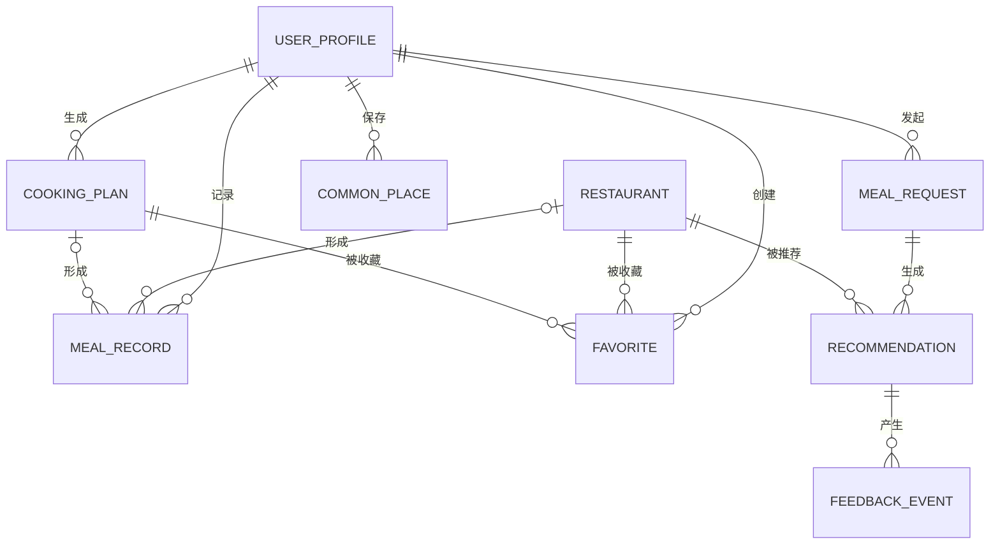

# 饮食小助手正式初版产品结构

## 已确认的产品边界

- 产品形态：移动端优先的公开网页，其他人通过网址直接使用
- 初版入口：去哪吃、自己做、记一笔、我的
- 初版不强制登录，每位用户的数据先保存在自己的浏览器中
- 浏览器本地数据不会自动跨设备同步，账号和云端同步留到后续版本
- 自己做根据现有食材、做饭时间、厨具和口味生成方案
- 不提供医疗建议，也不承诺精确营养计算
- 餐厅数据继续使用高德MCP和高德Web服务

## 第一步：核心对象

### 核心对象

| 对象 | 代码名称 | 说明 |
|---|---|---|
| 用户资料 | `UserProfile` | 保存口味、忌口、默认预算、常用地点等个人设置 |
| 外出用餐需求 | `MealRequest` | 保存位置、餐次、预算、人数、场合、口味和自定义要求 |
| 餐厅 | `Restaurant` | 保存高德POI信息、名称、地址、距离、人均、评分、营业时间、照片和导航位置 |
| 做饭方案 | `CookingPlan` | 保存现有食材、时间、厨具、口味要求，以及最终生成的材料和步骤 |
| 饮食记录 | `MealRecord` | 保存吃了什么、餐厅或菜名、时间、花费、感受、备注和照片 |

### 辅助对象

| 对象 | 代码名称 | 说明 |
|---|---|---|
| 推荐结果 | `Recommendation` | 记录一次外出用餐需求推荐了哪些餐厅、推荐顺序和推荐原因 |
| 收藏 | `Favorite` | 记录用户收藏的餐厅或做饭方案 |
| 反馈事件 | `FeedbackEvent` | 记录查看、换一家、不合适、选择和导航等行为 |
| 常用地点 | `CommonPlace` | 记录家、公司等用户经常使用的位置 |

### 对象与入口

| 入口 | 使用的主要对象 |
|---|---|
| 去哪吃 | `MealRequest`、`Restaurant`、`Recommendation` |
| 自己做 | `CookingPlan` |
| 记一笔 | `MealRecord` |
| 我的 | `UserProfile`、`Favorite`、`CommonPlace`和历史记录 |

### 对象边界

- 高德MCP和高德Web服务是数据来源，不是产品对象
- 餐厅照片是`Restaurant`的属性，不独立建对象
- 导航是用户对`Restaurant`执行的操作
- 初版没有云端账号，`UserProfile`代表当前浏览器中的本地用户资料
- `Favorite`是用户与餐厅或做饭方案之间的收藏关系

## 第二步：CSMA拆解

### 用户资料`UserProfile`

#### C：核心属性

- 口味偏好
- 忌口与过敏信息
- 默认人均预算
- 默认同行人数
- 默认常用地点
- 创建时间和更新时间

#### S：状态

```text
未设置 → 已设置 → 已修改
   ↑                  ↓
   └──── 清除并恢复默认值
```

#### M：元信息

- 浏览器本地用户标识
- 数据结构版本
- 最后更新时间

#### A：操作

- 查看和修改个人设置
- 重置为默认设置
- 管理常用地点
- 查看和管理收藏
- 查看饮食历史

### 外出用餐需求`MealRequest`

#### C：核心属性

- 当前位置坐标和位置名称
- 早餐、午餐、晚餐或夜宵
- 用餐场合
- 同行人数
- 人均预算
- 口味偏好
- 自定义要求
- 搜索范围
- 创建时间

#### S：状态

```text
填写中
  → 定位中
  → 查询中
      → 已有结果
          → 已选择
          → 已放弃
      → 无结果
          → 扩大范围后重新查询
      → 查询失败
          → 重试
```

#### M：元信息

- 定位来源
- 城市编码和行政区
- 筛选与排序规则版本
- 浏览器本地用户标识

#### A：操作

- 填写和修改用餐条件
- 获取或重新获取位置
- 发起推荐
- 扩大搜索范围
- 重试失败查询
- 结束本次选择

### 餐厅`Restaurant`

#### C：核心属性

- 高德POI编号
- 名称、品类和地址
- 坐标和距离
- 评分和人均消费
- 营业状态和营业时间
- 电话
- 照片列表
- 高德导航链接

#### S：状态

```text
候选
  → 符合条件
      → 已展示
          → 被跳过
          → 被选择
  → 不符合条件
      → 记录排除原因
```

#### M：元信息

- 数据来源
- 数据抓取时间
- 照片来源
- 字段完整度
- 高德原始地点类型

#### A：操作

- 查看餐厅卡片和详细信息
- 切换照片
- 收藏或取消收藏
- 标记推荐不合适
- 打开高德导航

### 做饭方案`CookingPlan`

#### C：核心属性

- 已有食材
- 可用做饭时间
- 可用厨具
- 用餐人数
- 口味偏好
- 补充要求
- 方案名称
- 所需材料和缺少材料
- 制作步骤
- 预计耗时
- 创建时间和更新时间

#### S：状态

```text
填写中
  → 生成中
      → 生成成功
          → 已收藏
          → 已完成
      → 生成失败
          → 重试
```

#### M：元信息

- 方案来源
- 数据结构版本
- 是否收藏
- 是否已经生成饮食记录

#### A：操作

- 填写和修改做饭条件
- 生成或重新生成方案
- 查看材料和步骤
- 收藏或取消收藏
- 标记已经做过
- 快速生成饮食记录

### 饮食记录`MealRecord`

#### C：核心属性

- 用餐日期和餐次
- 用餐方式：外出就餐、自己做、外卖或其他
- 餐厅或方案关联
- 餐厅名称或菜名
- 吃过的内容
- 花费
- 同行人数
- 用餐感受
- 备注
- 照片
- 创建时间和更新时间

#### S：状态

```text
编辑中 → 已保存 → 已修改
             ↓
           已删除
```

#### M：元信息

- 记录来源：手动、餐厅选择或做饭方案
- 浏览器本地用户标识
- 数据结构版本

#### A：操作

- 新建记录
- 从已选择餐厅快速创建
- 从做饭方案快速创建
- 查看和筛选历史
- 修改或删除记录

### 辅助对象补充

- `Recommendation`连接`MealRequest`和`Restaurant`，保存是否符合条件、推荐顺序、推荐理由和排除理由
- `Favorite`连接`UserProfile`与`Restaurant`或`CookingPlan`，保存收藏时间
- `FeedbackEvent`记录查看、换一家、不合适、选择和导航等行为
- `CommonPlace`保存地点名称、地址、坐标、地点类型和最后使用时间

### 安全边界

- 忌口和过敏信息只作为提示与偏好，不承诺餐厅或菜品完全排除风险
- 做饭方案不提供疾病治疗建议
- 做饭方案不承诺精确营养和热量计算

## 第三步：对象关系

### 关系总览



### 关系说明

| 起点 | 终点 | 关系 | 说明 |
|---|---|---|---|
| 用户资料 | 外出用餐需求 | 一对多 | 一个本地用户可以发起多次去哪吃决策 |
| 用户资料 | 做饭方案 | 一对多 | 一个本地用户可以生成和保存多个方案 |
| 用户资料 | 饮食记录 | 一对多 | 一个本地用户可以保存多条记录 |
| 用户资料 | 常用地点 | 一对多 | 保存家、公司等位置 |
| 外出用餐需求 | 推荐结果 | 一对多 | 一次查询产生多家候选餐厅 |
| 餐厅 | 推荐结果 | 一对多 | 同一家餐厅可以出现在多次查询中 |
| 推荐结果 | 反馈事件 | 一对多 | 记录查看、换一家、不合适、选择和导航 |
| 用户资料 | 收藏 | 一对多 | 统一管理餐厅和做饭方案收藏 |
| 收藏 | 餐厅或做饭方案 | 多对一 | 每条收藏只能指向一种对象 |
| 饮食记录 | 餐厅 | 可选关联 | 从去哪吃快速记一笔时保留餐厅快照 |
| 饮食记录 | 做饭方案 | 可选关联 | 从自己做快速记一笔时保留方案摘要 |

### 跨入口流转

- 去哪吃选中餐厅后可以收藏、导航或快速记一笔
- 自己做生成方案后可以收藏或快速记一笔
- 记一笔既能手动创建，也能接收餐厅和做饭方案带来的预填信息
- 我的统一管理资料、常用地点、收藏和历史记录
- 删除餐厅收藏不删除相关饮食记录
- 删除做饭方案时，已经生成的饮食记录保留方案名称和摘要，不随方案删除
- 用户清除全部本地数据时，资料、收藏、记录、方案、常用地点和照片一并删除

## 第四步：页面结构

### 1. 应用外壳

- 顶部显示当前模块名称和必要的返回操作
- 底部固定四个入口：去哪吃、自己做、记一笔、我的
- 切换入口时保留当前表单和浏览位置
- 首次进入默认打开去哪吃
- 全站提供加载、空状态、错误和成功反馈

### 2. 去哪吃

#### 用餐需求区

- 当前地点与定位
- 常用地点快捷选择
- 餐次、场合、同行人数、口味、自定义要求和人均预算
- 发起推荐按钮

#### 推荐浏览区

- 当前条件摘要
- 餐厅卡、多张实景照片、序号和数据来源
- 推荐理由、评分、人均、距离和营业信息
- 上一家、换一家、收藏、详情、去这里、记一笔和不合适

#### 餐厅信息层

- 完整地址、电话、营业时间、照片和高德导航
- 字段缺失时隐藏对应内容，不使用虚构值

#### 不合适反馈层

- 餐次不符、场合不符、超预算、距离太远、已打烊、不喜欢品类、其他
- 提交后记录事件并展示下一家

### 3. 自己做

#### 条件输入区

- 已有食材，可用逗号或换行分隔
- 可用时间
- 用餐人数
- 可用厨具
- 口味偏好和补充要求
- 生成方案按钮

#### 方案结果区

- 方案名称和预计耗时
- 已有材料、还需准备的材料
- 分步做法
- 注意事项
- 换一个方案、收藏、记为吃过

#### 空状态与失败状态

- 尚未生成时说明需要填写哪些内容
- 没有匹配方案时允许减少限制或重新填写
- 规则库异常时保留输入并允许重试

### 4. 记一笔

#### 记录列表

- 按时间倒序展示日期、餐次、用餐方式、菜名或餐厅、花费和感受
- 支持按用餐方式和日期筛选
- 空状态提供新建第一条记录按钮

#### 新建与编辑

- 用餐日期、餐次、用餐方式
- 餐厅或菜名、吃了什么、花费、同行人数
- 感受、备注和一张照片
- 从餐厅或做饭方案进入时自动预填已知信息

#### 记录详情

- 展示全部记录内容和照片
- 提供修改和删除
- 删除需要二次确认，删除后允许短时撤销

### 5. 我的

#### 个人偏好

- 默认预算、默认同行人数、口味偏好、忌口和过敏提示
- 忌口和过敏只作为提示，不承诺完全规避

#### 常用地点

- 添加、修改、删除家、公司等地点
- 选择一个默认地点

#### 收藏

- 餐厅收藏和做饭方案收藏分组展示
- 可以打开来源详情或取消收藏

#### 历史与数据

- 去哪吃历史、做饭方案和饮食记录入口
- 显示数据仅保存在当前浏览器
- 提供清除全部本地数据，操作前二次确认

### 6. 页面状态

- 首次使用：各模块显示可直接开始的空状态
- 加载中：主操作按钮禁止重复提交并显示当前动作
- 网络失败：保留输入，显示重试入口
- 高德失败：不伪造真实餐厅，保留查询条件
- 本地存储失败：提示浏览器空间或隐私模式限制，不声称已经保存
- 图片处理失败：保留文字记录并允许重新选择照片
- 窄屏优先，桌面端保持单列内容并限制最大宽度

## 数据模型草案

初版不使用云端账号数据库。结构化数据使用带版本号的浏览器本地存储，用户照片使用IndexedDB保存。后续接入账号时，保持对象编号和时间字段不变，便于迁移。

### `userProfile`

| 字段 | 类型 | 约束 |
|---|---|---|
| `id` | string | 本地固定标识 |
| `tastePreferences` | string[] | 默认空数组 |
| `dietaryRestrictions` | string[] | 默认空数组 |
| `defaultBudget` | number | 0至10000 |
| `defaultPartySize` | number | 1至50的整数 |
| `defaultCommonPlaceId` | string或null | 关联常用地点 |
| `createdAt` | ISO string | 非空 |
| `updatedAt` | ISO string | 非空 |

### `mealRequests`

沿用MVP的`MealRequest`字段，增加`status`、`selectedRestaurantId`和`updatedAt`。最多保留最近50次，超出后删除最早且没有关联饮食记录的请求。

### `restaurants`

沿用高德标准化餐厅快照。长期收藏必须保留名称、地址、坐标、品类和高德POI编号；距离、营业状态和评分仍以当前查询快照为准。

### `cookingPlans`

| 字段 | 类型 | 约束 |
|---|---|---|
| `id` | string | 主键 |
| `ingredients` | string[] | 至少1项 |
| `availableMinutes` | number | 5至240 |
| `partySize` | number | 1至20 |
| `tools` | string[] | 可空 |
| `tastePreferences` | string[] | 可空 |
| `customRequirement` | string | 最长200字 |
| `title` | string | 非空 |
| `requiredIngredients` | string[] | 非空 |
| `missingIngredients` | string[] | 可空 |
| `steps` | string[] | 至少1步 |
| `estimatedMinutes` | number | 非空 |
| `status` | string | `generated`、`completed`或`deleted` |
| `createdAt` | ISO string | 非空 |
| `updatedAt` | ISO string | 非空 |

### `mealRecords`

| 字段 | 类型 | 约束 |
|---|---|---|
| `id` | string | 主键 |
| `mealDate` | `YYYY-MM-DD` | 非空 |
| `mealPeriod` | string | 早餐、午餐、晚餐或夜宵 |
| `sourceType` | string | `restaurant`、`cooking`、`takeout`或`other` |
| `sourceId` | string或null | 可关联餐厅或做饭方案 |
| `title` | string | 餐厅名或菜名，非空 |
| `foods` | string | 最长500字 |
| `cost` | number或null | 0至100000 |
| `partySize` | number | 1至50 |
| `feeling` | string | `great`、`okay`或`bad` |
| `note` | string | 最长1000字 |
| `photoId` | string或null | 关联IndexedDB照片 |
| `createdAt` | ISO string | 非空 |
| `updatedAt` | ISO string | 非空 |
| `deletedAt` | ISO string或null | 软删除和撤销使用 |

### `favorites`

| 字段 | 类型 | 约束 |
|---|---|---|
| `id` | string | 主键 |
| `targetType` | string | `restaurant`或`cookingPlan` |
| `targetId` | string | 非空 |
| `snapshot` | object | 保存列表展示需要的名称、图片和摘要 |
| `createdAt` | ISO string | 非空 |

唯一约束：`targetType + targetId`。

### `commonPlaces`

| 字段 | 类型 | 约束 |
|---|---|---|
| `id` | string | 主键 |
| `label` | string | 最长20字 |
| `address` | string | 非空 |
| `longitude` | number | 非空 |
| `latitude` | number | 非空 |
| `placeType` | string | `home`、`work`或`other` |
| `lastUsedAt` | ISO string | 可空 |

### 本地存储约定

- 所有结构化数据包包含`schemaVersion`
- 写入前校验字段范围，解析失败时保留原始损坏数据并恢复空状态
- 照片压缩后存入IndexedDB，单张最大2MB，每条饮食记录最多1张
- 用户清除数据时同时清理本地存储和IndexedDB
- 不在前端存储高德Key或任何服务端密钥

## 后续功能拆解

正式初版使用统一验收文档`pm-20260724-diet-helper-v1-ac.md`，覆盖应用外壳、去哪吃补全、自己做、记一笔、我的和本地存储。
